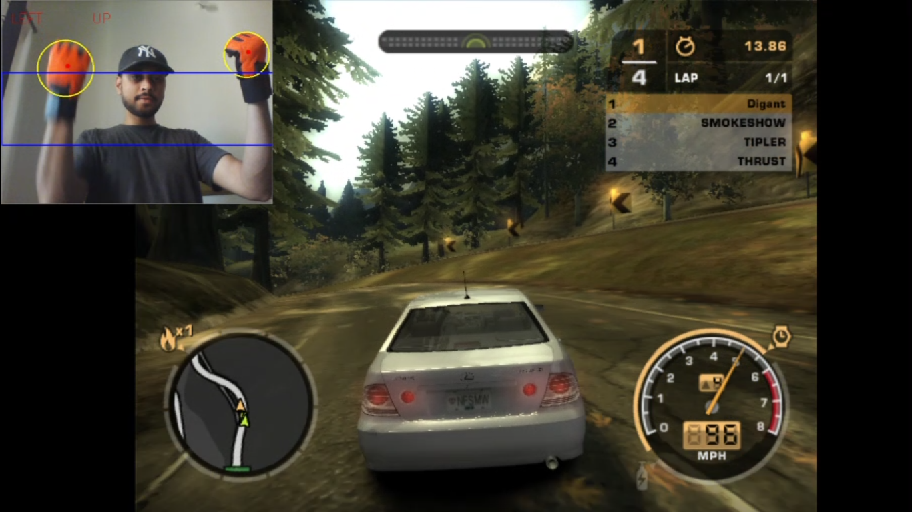

# Gesture Gaming with python

Experience the fun of playing games with gestures. 

#### Requirements

  - python 3.x
  - imutils
  - numpy
  - opencv-python

I have created a program to detect orange objects in a frame. Created a window of 160 pixels in the center of the frame(the blue rectangluar window) and logically divided the frame into two halves. The left half is used for turning the vehicle left or right and the right half takes the decision  of accelerate and brake.

This is a simple concept of controlling W,A,S,D keyboard keys and can be used for other keys as well as other games.

In this project I have detected orange objects. You can modify line no 13,14 in `gameControl.py` to use it for other objects. `hsvRealtime.py` can be used to find the hsv values used in the threshold values at line 13,14 in `gameControl.py`.

Here is the link to YouTube video of my NFS gameplay using gestures. [Link](https://youtu.be/-lt3_hajI3k)